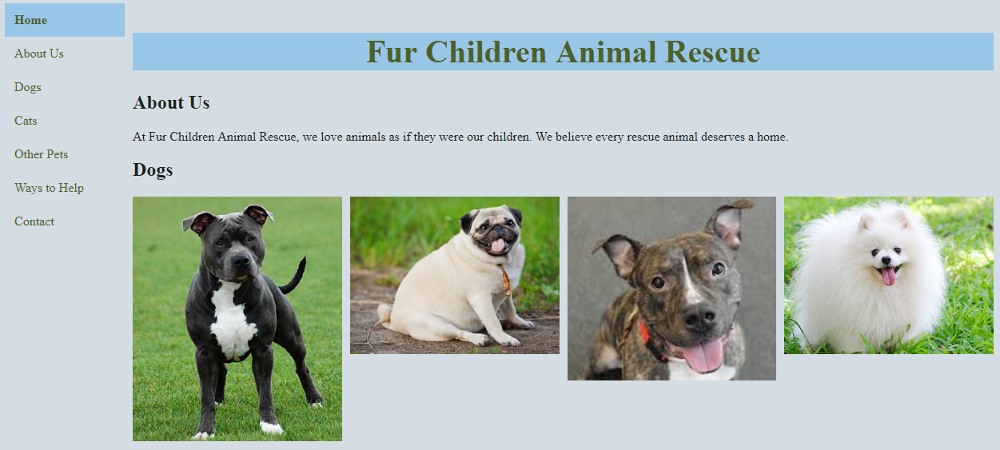

# Fur Children Animal Rescue Website

This is a sample animal rescue website implemented in TypeScript/Next.js.

I love animals and they deserve a website to help them put their best paw forward.

Please note that the rescue is not real and all of the pet data is made up. The images are either from PetFinder or from a Google image search. The contact information is clearly for example purposes only.

I expect actual pet listings would link from the image to PetFinder, so the modal popup is also for example purposes.



## Viewing the Site

```
npm run dev
```

## Real World Changes

If this were a real website:

- The database would actually be a database
- Or everything would be driven by PetFinder
- The option dropdown would dynamically populate
- There would be tests to ensure database connector methods
- Pets would have ids so that names aren't treated as unique
- The fake data would be... real

But hey, this is just an example!
