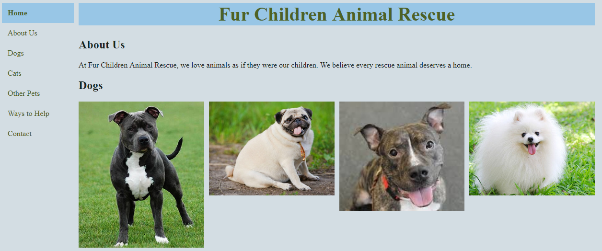

# Fur Children Animal Rescue Website

This is a sample animal rescue website implemented in HTML/CSS/JavaScript with tests written in QUnit.

I love animals and they deserve a website to help them put their best paw forward.

Please note that the rescue is not real and all of the pet data is made up.  The images are either from PetFinder or from a Google image search.  The contact information is clearly for example purposes only.

I expect actual pet listings would link from the image to PetFinder, so the modal popup is also for example purposes.

## Viewing the Site

Clone the repository, then double-click on the `index.html` file.

## Running the Unit Tests

Clone the repository, then double-click on the `tests.html` file.

## Supported Browsers

* Chrome
* Firefox

Note that IE11 is not supported because it does not support `display: grid`.  Even when using the older specification for it with the `-ms-` prefix, the `grid-gap` property is not supported at all.  This means the lists of adoptable pets will not be displayed properly.
